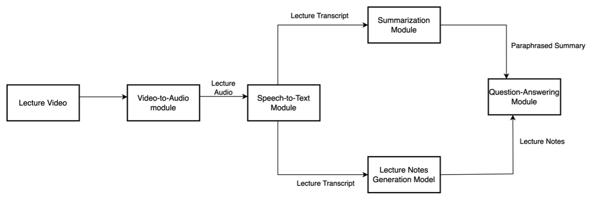

# StudyBuddy - AI-Powered Learning Assistant

<div align="center">
  
  <p>Transform your learning experience with AI-powered study tools</p>
</div>

## Inspiration

StudyBuddy was born from the challenges students face in effectively processing and retaining information from educational videos and documents. We recognized that traditional note-taking methods often fall short in capturing the full depth of learning materials, and students need more interactive and engaging ways to study. Our inspiration came from the desire to create an AI-powered study companion that could transform passive learning into an active, engaging experience.

## 🌟 Features

- **Video & PDF Processing**

  - Upload educational videos or PDFs
  - Support for YouTube video links
  - Automatic transcription of video content
  - PDF text extraction and analysis

- **AI-Powered Study Tools**

  - 📝 Smart Notes Generation
  - 🎴 Interactive Flashcards
  - 🧠 Mind Maps
  - ❓ Auto-generated Quizzes
  - 💬 Context-aware Chat Assistant
  - 📊 Progress Tracking

- **User Experience**
  - 🌓 Dark/Light Theme
  - 📱 Responsive Design
  - 🔒 Secure Authentication
  - 📚 Study History
  - 📥 PDF Export

## 🏗️ Architecture

<div align="center">
  
</div>

## 🚀 Tech Stack

### Frontend

- [Next.js 15](https://nextjs.org/) - React Framework
- [TypeScript](https://www.typescriptlang.org/) - Type Safety
- [Tailwind CSS](https://tailwindcss.com/) - Styling
- [Radix UI](https://www.radix-ui.com/) - UI Components
- [React Flow](https://reactflow.dev/) - Mind Map Visualization
- [Lucide Icons](https://lucide.dev/) - Icons

### Backend

- [Flask](https://flask.palletsprojects.com/) - Python Web Framework
- [MongoDB](https://www.mongodb.com/) - Database
- [Google Cloud Speech-to-Text](https://cloud.google.com/speech-to-text) - Audio Transcription
- [Google Gemini](https://cloud.google.com/vertex-ai) - AI/ML Processing
- [PyTube](https://pytube.io/) - YouTube Integration

## 🛠️ Setup & Installation

### Prerequisites

- Node.js 18+ and npm
- Python 3.8+
- MongoDB
- FFmpeg
- Google Cloud Account with necessary APIs enabled

### Frontend Setup

```bash
# Navigate to frontend directory
cd frontend/study-buddy

# Install dependencies
npm install

# Start development server
npm run dev
```

### Backend Setup

```bash
# Navigate to backend directory
cd backend

# Create virtual environment
python -m venv venv
source venv/bin/activate  # On Windows: venv\Scripts\activate

# Install dependencies
pip install -r requirements.txt

# Install FFmpeg (macOS)
brew install ffmpeg

# Start backend server
python app.py
```

### Environment Variables

#### Frontend (.env)

```env
NEXT_PUBLIC_API_URL=http://localhost:5001
```

#### Backend (.env)

```env
MONGO_URI=your_mongodb_connection_string
GCS_BUCKET_NAME=your_gcs_bucket_name
GOOGLE_APPLICATION_CREDENTIALS=path_to_your_service_account_json
```

## 📝 Usage

1. **Authentication**

   - Register a new account or login
   - Secure session management

2. **Content Upload**

   - Upload video files or PDFs
   - Paste YouTube URLs
   - Support for multiple formats

3. **Study Tools**

   - Access auto-generated study materials
   - Interact with AI chat assistant
   - Export notes as PDF
   - Review with flashcards
   - Visualize concepts with mind maps
   - Test knowledge with quizzes

4. **History & Progress**
   - Track learning progress
   - Access previous study materials
   - Review past sessions

## 📄 License

This project is licensed under the MIT License - see the [LICENSE](LICENSE) file for details.

## Authors:

1. Akshay Chavan
2. Sudhanva Paturkar
3. Aditya Deshpande
4. Prathamesh Akole

---

<div align="center">
  Made with ❤️ for better learning
</div>
