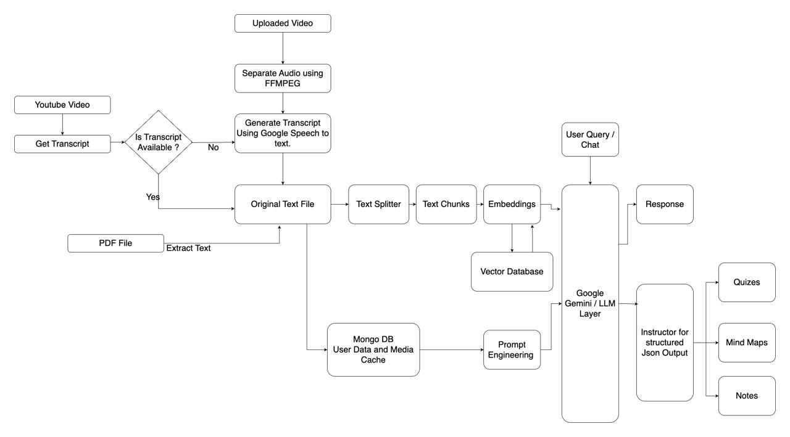

# StudyBuddy - AI-Powered Learning Assistant

<div align="center">
  
  <p>Transform your learning experience with AI-powered study tools</p>
</div>

## Authors:

1. Akshay Chavan
2. Sudhanva Paturkar
3. Aditya Deshpande
4. Prathamesh Akole

## Inspiration

StudyBuddy was born from the challenges students face in effectively processing and retaining information from educational videos and documents. We recognized that traditional note-taking methods often fall short in capturing the full depth of learning materials, and students need more interactive and engaging ways to study. Our inspiration came from the desire to create an AI-powered study companion that could transform passive learning into an active, engaging experience.

## 🌟 Features

- **Video & PDF Processing**

  - Upload educational videos or PDFs
  - Support for YouTube video links
  - Automatic transcription of video content
  - PDF text extraction and analysis

- **AI-Powered Study Tools**

  - 📝 Smart Notes Generation
  - 🎴 Interactive Flashcards
  - 🧠 Mind Maps
  - ❓ Auto-generated Quizzes
  - 💬 Context-aware Chat Assistant
  - 📊 Progress Tracking

- **User Experience**
  - 🌓 Dark/Light Theme
  - 📱 Responsive Design
  - 🔒 Secure Authentication
  - 📚 Study History
  - 📥 PDF Export

## 🏗️ Architecture

<div align="center">
  
</div>

## 🚀 Tech Stack

### Frontend

- [Next.js 15](https://nextjs.org/) - React Framework
- [TypeScript](https://www.typescriptlang.org/) - Type Safety
- [Tailwind CSS](https://tailwindcss.com/) - Styling
- [Radix UI](https://www.radix-ui.com/) - UI Components
- [React Flow](https://reactflow.dev/) - Mind Map Visualization
- [Lucide Icons](https://lucide.dev/) - Icons

### Backend

- [Flask](https://flask.palletsprojects.com/) - Python Web Framework
- [MongoDB](https://www.mongodb.com/) - Database
- [Google Cloud Speech-to-Text](https://cloud.google.com/speech-to-text) - Audio Transcription
- [Google Gemini](https://cloud.google.com/vertex-ai) - AI/ML Processing
- [PyTube](https://pytube.io/) - YouTube Integration

## 🛠️ Setup & Installation

### Prerequisites

- Node.js 18+ and npm
- Python 3.8+
- MongoDB
- FFmpeg
- Google Cloud Account with necessary APIs enabled

### Frontend Setup

```bash
# Navigate to frontend directory
cd frontend/study-buddy

# Install dependencies
npm install

# Start development server
npm run dev
```

### Backend Setup

```bash
# Navigate to backend directory
cd backend

# Create virtual environment
python -m venv venv
source venv/bin/activate  # On Windows: venv\Scripts\activate

# Install dependencies
pip install -r requirements.txt

# Install FFmpeg (macOS)
brew install ffmpeg

# Start backend server
python app.py
```

### Environment Variables

#### Backend (.env)

```env
MONGO_URI=your_mongodb_connection_string
GCS_BUCKET_NAME=your_gcs_bucket_name
GOOGLE_APPLICATION_CREDENTIALS=path_to_your_service_account_json
```

## 🔑 Google Cloud Setup Guide

### 1. Create a Google Cloud Project

1. Go to [Google Cloud Console](https://console.cloud.google.com/)
2. Click on the project dropdown near the top of the page
3. Click "New Project"
4. Enter a project name and click "Create"

### 2. Enable Required APIs

1. In the Google Cloud Console, go to "APIs & Services" > "Library"
2. Search for and enable these APIs:
   - "Google Cloud Speech-to-Text API"
   - "Gemini API"
   - "Cloud Storage API"

For each API:

- Click on the API name
- Click "Enable"
- Wait for activation to complete

### 3. Create a Service Account & Generate Key

1. Go to "IAM & Admin" > "Service Accounts"
2. Click "Create Service Account"
3. Fill in the details:
   - Name: `studybuddy-service`
   - Description: `Service account for StudyBuddy application`
4. Click "Create and Continue"
5. Add these roles:
   - `Cloud Speech-to-Text User`
   - `Storage Object Viewer`
   - `Storage Object Creator`
6. Click "Continue" and then "Done"
7. Generate the key:
   - Find your service account in the list
   - Click the three dots (⋮) under "Actions"
   - Select "Manage keys"
   - Click "Add Key" > "Create new key"
   - Choose "JSON" format
   - Click "Create"
   - The key file will automatically download

### 4. Set Up Google Cloud Storage

1. Go to "Cloud Storage" > "Buckets"
2. Click "Create Bucket"
3. Configure your bucket:
   - Choose a unique name
   - Select your preferred location
   - Leave other settings as default
4. Click "Create"

### 5. Get Gemini API Key

1. Visit [Google AI Studio](https://makersuite.google.com/app/apikey)
2. Click "Get API Key"
3. If you don't have any keys:
   - Click "Create API key"
   - Copy and save the key securely
4. If you have existing keys:
   - Use an existing key or create a new one
   - Copy the key value

### 6. Configure Environment Variables

1. Move the downloaded service account JSON key to your project's backend directory
2. Update your `backend/.env` file with:
   ```env
   GOOGLE_APPLICATION_CREDENTIALS=./your-service-account-key.json
   GCS_BUCKET_NAME=your-bucket-name
   GEMINI_API_KEY=your-gemini-api-key
   ```

### Important Security Notes

1. **Never commit your service account key or API keys to version control**
2. Add these patterns to your `.gitignore`:
   ```
   *.json
   .env
   ```
3. Keep your API keys and service account key secure
4. Rotate keys periodically for security
5. Set up proper IAM roles and permissions in production

### Troubleshooting Google Cloud Setup

1. **API Enabling Issues**

   - Ensure billing is enabled for your project
   - Wait a few minutes after enabling APIs
   - Check if you have necessary permissions

2. **Service Account Issues**

   - Verify the key file is in the correct location
   - Check if the service account has required roles
   - Ensure the key file path in `.env` is correct

3. **Storage Bucket Issues**

   - Verify bucket name is globally unique
   - Check if service account has storage permissions
   - Ensure bucket location matches your requirements

4. **Gemini API Issues**
   - Verify API key is correctly copied
   - Check if you're within API quotas
   - Ensure the API is properly enabled

For any other issues, consult the [Google Cloud Documentation](https://cloud.google.com/docs) or [Google AI Studio Documentation](https://ai.google.dev/).

## 📝 Usage

1. **Authentication**

   - Register a new account or login
   - Secure session management

2. **Content Upload**

   - Upload video files or PDFs
   - Paste YouTube URLs
   - Support for multiple formats

3. **Study Tools**

   - Access auto-generated study materials
   - Interact with AI chat assistant
   - Export notes as PDF
   - Review with flashcards
   - Visualize concepts with mind maps
   - Test knowledge with quizzes

4. **History & Progress**
   - Track learning progress
   - Access previous study materials
   - Review past sessions

## 📄 License

This project is licensed under the MIT License - see the [LICENSE](LICENSE) file for details.

---

<div align="center">
  Made with ❤️ for better learning
</div>
